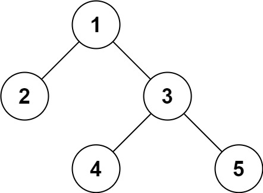

# Serialize and Deserialize Binary Tree

Serialization is the process of converting a data structure or object into a sequence of bits so that it can be stored in a file or memory buffer, or transmitted across a network connection link to be reconstructed later in the same or another computer environment.

Design an algorithm to serialize and deserialize a binary tree. There is no restriction on how your serialization/deserialization algorithm should work. You just need to ensure that a binary tree can be serialized to a string and this string can be deserialized to the original tree structure.

## Examples:

Input: `root = [1,2,3,null,null,4,5]`
Output: `[1,2,3,null,null,4,5]`

## Difficulty:

`hard`

## Learning Objectives:

+ String
+ Tree
+ Depth-First Search
+ Breadth-First Search
+ Design
+ Binary Tree

## Link:

[problem on leetcode](https://leetcode.com/problems/serialize-and-deserialize-binary-tree/)
